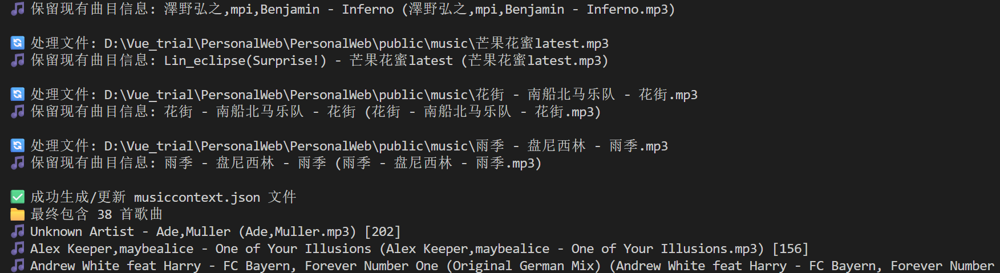
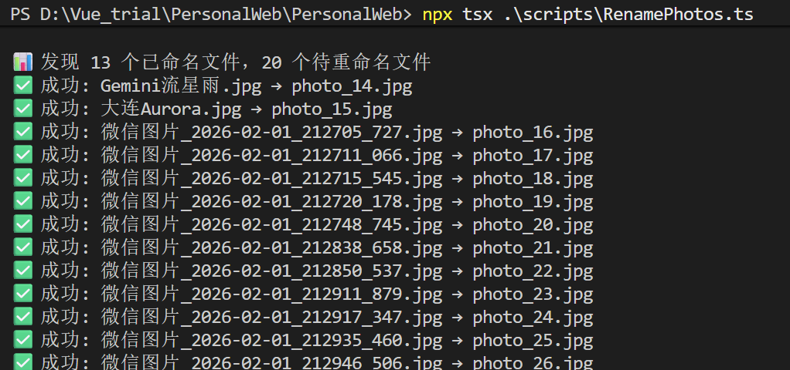

# Yb's Personal Web - 个人静态博客项目

这是一个现代化、功能丰富的个人博客网站项目，采用Vue 3 + TypeScript技术栈构建。该项目集成了文章系统、音乐播放器、相册展示等多种功能，具有出色的动画效果和用户体验。

## ✨ 项目亮点

### 1. 现代化技术栈
- **Vue 3 + TypeScript**: 提供更强大的类型安全和开发体验
- **Pinia**: 轻量级状态管理，替代Vuex
- **Vue Router 4**: 动态路由管理
- **Vite**: 快速的构建工具，热更新体验极佳
- **ESLint + Prettier**: 统一代码风格和质量保证

### 2. 模板化架构
- **组件化设计**: 页面、功能模块高度组件化，易于维护和扩展
- **标准化路由结构**: 清晰的路由配置，支持嵌套路由
- **统一状态管理**: 使用Pinia进行全局状态管理，数据流清晰
- **可复用UI组件**: 如标签云、音乐播放器等，提高开发效率

### 3. 自动化脚本系统
- **文章自动生成**: `npm run generate-articles` 扫描Markdown文件并生成索引
- **相册自动生成**: `npm run generate-albums` 自动扫描图片文件夹并生成相册列表
- **音乐库自动生成**: `npm run generate-songs` 自动扫描音频文件并生成播放列表
- **图片批量重命名**: `npx tsx scripts/RenamePhotos.ts` 提供交互式图片重命名工具，采用插入式重命名，防止删除后出现滚动黑屏、重命名覆盖丢失后侧所有照片等情况。


### 4. 出色的动画效果
- **多动画页面**: 包含多个精心设计的动画页面，提供丰富视觉体验
- **物理引擎**: 相册详情页使用物理模拟，图片有动态飘浮效果
- **过渡动画**: 页面切换、元素出现都有平滑过渡效果
- **粒子效果**: 使用Canvas Confetti实现庆祝动画效果
- **悬停交互**: 大量悬停效果增强用户交互体验

### 5. 完整的内容管理系统
#### 文章系统
- **Markdown支持**: 支持Front Matter格式的Markdown文章
- **元数据管理**: 标题、日期、分类、标签等结构化数据
- **标签云**: 可视化标签展示，方便内容检索
- **文章搜索**: 按分类、标签筛选文章

#### 音乐播放器
- **全站播放器**: 悬浮播放器，跨页面播放
- **播放列表管理**: 支持播放、暂停、上一首、下一首
- **音量控制**: 实时音量调节
- **进度控制**: 可拖拽进度条
- **音乐分类**: 按类型分类播放
- **封面展示**: 精美的专辑封面展示

#### 相册展示
- **胶片式浏览**: 独特的水平滚动胶片效果
- **物理动画**: 相册详情页的图片物理运动效果
- **响应式布局**: 适配不同屏幕尺寸
- **懒加载优化**: 图片懒加载提升性能

### 6. 响应式设计
- **移动端适配**: 完美适配手机、平板、桌面设备
- **触摸友好**: 触摸设备上的良好交互体验
- **灵活布局**: 使用Flexbox和Grid实现灵活布局

### 7. 开发者友好
- **TypeScript支持**: 提供完整的类型定义
- **模块化配置**: 清晰的配置文件结构
- **开发服务器**: Vite提供的快速热重载开发环境
- **构建优化**: 生产环境代码压缩和优化

## 🚀 快速开始

### 环境要求
- Node.js ^20.19.0 或 >=22.12.0
- npm 或 pnpm

### 安装步骤

```bash
# 克隆项目
git clone <repository-url>

# 进入项目目录
cd PersonalWeb

# 安装依赖
npm install

# 启动开发服务器
npm run dev
```

### 构建生产版本

```bash
# 构建项目
npm run build

# 预览生产版本
npm run preview
```

## 📁 项目结构
```
src/ ├── component/ # Vue组件 
     │ ├── Main/ # 主界面组件 
     │ ├── Pages/ # 页面组件（文章、音乐、相册等） 
     │ └── welcome/ # 欢迎页面组件 
     ├── router/ # 路由配置 
     ├── stores/ # Pinia状态管理 
     ├── service/ # 业务服务层 
     ├── main.ts # 应用入口 
     └── App.vue # 根组件

public/ ├── article/ # 文章Markdown文件
        ├── album/ # 相册图片 
        ├── music/ # 音频文件 
        ├── images/ # 其他图片资源
        └── resources/ # 欢迎页展示墙的图片/GIF 及 welcomeShowcase.json 配置

scripts/ # 自动化脚本 
       ├── generate-articles-json.ts # 生成文章索引
       ├── generate-albums-json.ts # 生成相册索引
       ├── generate-songs-json.ts # 生成音乐索引
       └── RenamePhotos.ts # 图片重命名工具
```

## 🛠️ 内容管理

### 添加文章
1. 在 `public/article/` 目录下创建 `.md` 文件
2. 文件命名规则：任意，如 `my-article.md`
3. 在文件顶部添加 Front Matter 元数据：

```markdown
---
title: 文章标题
date: 2024-12-18
category: 文章分类
tags: [标签1, 标签2, 标签3]
description: 文章描述
---

# 正文内容
```

4. 重新生成文章索引：
```bash
npm run generate-articles
```

### 添加相册
1. 在 `public/album/` 目录下创建相册文件夹
2. 将图片放入文件夹（推荐使用脚本重命名）
3. 可选：创建 `album_config.md` 配置文件设置标题、日期等
4. 重新生成相册索引：
```bash
npm run generate-albums
```

### 添加音乐
1. 在 `public/music/` 目录下放入音频文件
2. 同时放入对应的封面图片
3. 重新生成音乐索引：
```bash
npm run generate-songs
```

### 自定义欢迎页展示墙（Animation2）

欢迎页轮播展示墙的**全部内容与时序**都抽离到了 `public/resources/welcomeShowcase.json`，改动无需修改组件代码，保存 JSON 即可生效。

#### 1. 准备资源文件
将图片与 GIF 放入 `public/resources/` 目录，然后在 `src/component/welcome/welcomeResources.ts` 中登记资源 key：

```ts
export const welcomeResources = {
  gifs: {
    musiala: { src: resourceUrl('Musiala.gif'), alt: '...' },
    // 新增 GIF：key 名可自定义，供 JSON 引用
  },
  photos: {
    diaz: { src: resourceUrl('Diaz.jpg'), alt: '...' },
    // 新增图片同理
  },
}
```

> `welcomeResources.ts` 只维护「资源 key → { src, alt }」的映射，是资源的唯一登记表；JSON 中一律通过 key 引用，避免路径散落各处。

#### 2. 配置文件结构（`welcomeShowcase.json`）

```jsonc
{
  "timing": {
    "panelDurationMs": 5000,   // 每个页面停留时长（毫秒）
    "totalDurationMs": 30000   // 整个 Animation2 强制跳转的总时长（毫秒）
  },
  "styles": {                  // 可复用的样式模板，批量增删页面时直接引用
    "red":   { "tone": "red",   "direction": "to-right", "accent": "#e30613" },
    "black": { "tone": "black", "direction": "to-left",  "accent": "#0d0d0d" }
  },
  "panels": [
    {
      "id": "musiala",         // 页面唯一标识
      "style": "red",          // 引用 styles 中的模板（red / black）
      "kicker": "ATTACK CHANNEL 01",
      "title": "JAMAL MUSIALA",
      "body": "描述性文字……",
      "stat": "DRIBBLE / VISION / SPARK",
      "heroPhoto": "musiala",  // 引用 welcomeResources.photos 的 key
      "photos": ["musiala", "teamUcl"],
      "gifs": ["musiala", "kane"]  // 引用 welcomeResources.gifs 的 key
    }
  ]
}
```

#### 3. 批量增删页面
- **新增页面**：在 `panels` 数组追加一项，`style` 选择 `red` 或 `black` 复用样式，`photos` / `gifs` 填入已登记的资源 key 即可。
- **删除页面**：直接移除对应的数组元素。
- **调整节奏**：只改 `timing.panelDurationMs`（单页停留）与 `timing.totalDurationMs`（总时长强制跳转），组件的轮播定时器、倒计时按钮均从此处读取。
- **黑红相间**：按顺序交替使用 `red` / `black` 两种 style 即可保证配色节奏一致。

> 提示：`gifs` 支持将同一 GIF 用于多个页面；底部资源滚动条会自动对全部页面用到的图片与 GIF 去重后展示。

## 🔧 自动化脚本

### 文章索引生成
```bash
npm run generate-articles
# 或
npx tsx scripts/generate-articles-json.ts
```

### 相册索引生成
```bash
npm run generate-albums
# 或
npx tsx scripts/generate-albums-json.ts
```

### 音乐库索引生成
```bash
npm run generate-songs
# 或
npx tsx scripts/generate-songs-json.ts
```

### 图片批量重命名
```bash
npx tsx scripts/RenamePhotos.ts
```

## 🎨 设计特色

### 视觉效果
- **玻璃拟态设计**: 大量使用backdrop-filter实现毛玻璃效果
- **渐变色彩**: 精心设计的渐变背景
- **光影效果**: 微妙的阴影和发光效果
- **动态交互**: 丰富的鼠标悬停和点击反馈

### 用户体验
- **流畅动画**: 所有交互都有平滑的动画过渡
- **直观导航**: 清晰的导航结构和面包屑
- **内容组织**: 合理的信息层级和视觉引导
- **无障碍设计**: 考虑可访问性的设计

## 📊 部署

构建完成后，`dist` 目录包含所有静态资源，可部署到任何支持静态文件托管的服务：

- GitHub Pages
- Netlify
- Vercel
- 传统Web服务器

## 🤝 贡献

欢迎提交Issue和Pull Request来改进这个项目！

## 📄 许可证

此项目仅供学习和参考使用。

---

<div align="center">

**项目技术栈：Vue 3 + TypeScript + Vite + Pinia + Vue Router**

Built with ❤️ for developers and content creators

</div>
